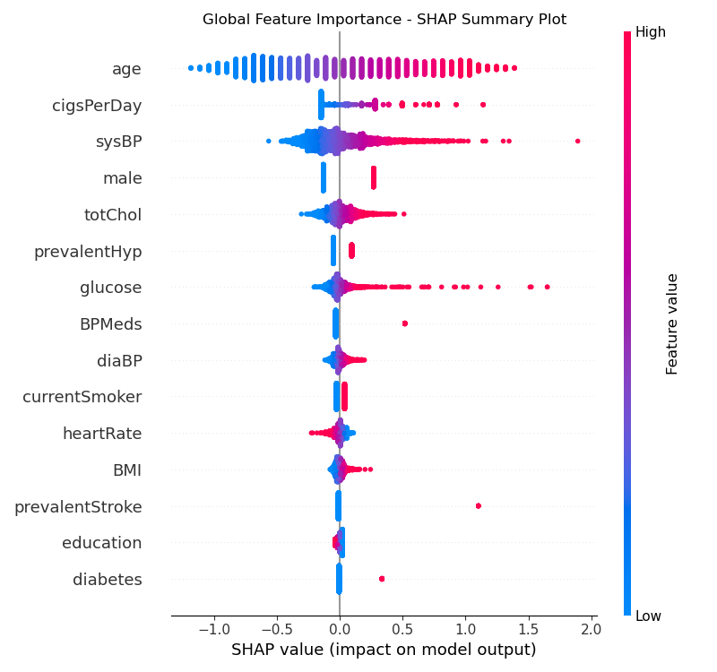

# Health Risk Scoring Model
### An interpretable machine learning model for predicting 10-year CHD risk from clinical and lifestyle features.

This project develops an interpretable machine learning model for predicting 10-year coronary heart disease (CHD) risk using patient clinical and lifestyle data. The goal is to deliver a transparent, explainable risk-scoring system that combines predictive accuracy with SHAP-based interpretability, making it suitable for healthcare providers, insurers, and wellness platforms focused on preventive care and early intervention.

### Key Features:

- **Fully reproducible ML pipeline** using scikit-learn (preprocessing + modeling + evaluation
- **Transparent and interpretable predictions** powered by SHAP (global and local explanations).
- **Comprehensive EDA** highlighting feature distributions, correlations, and risk patterns.
- **Balanced logistic regression model** optimized for minority-class recall in medical contexts.
- **Clear evaluation metrics** including ROC-AUC, classification reports, and confusion matrices.
- **Clinically aligned risk factor importance** (age, smoking, systolic BP, cholesterol, glucose).
- **Portable architecture** ready for deployment or integration into a Streamlit app.

### Why This Project Matters
Cardiovascular disease remains one of the leading causes of death worldwide, and early identification of high-risk individuals is essential for effective prevention. However, many predictive models lack transparency, making them difficult to trust in clinical or insurance settings.
This project addresses that gap by combining **strong predictive performance** and **clear, explainable reasoning** behind every prediction. It allows practitioners to understand exactly which factors contribute to a patient’s risk score.

This balance of accuracy and explainability is crucial for real-world medical decision support.

### Who This Tool is For

This risk-scoring model can support a wide range of healthcare and wellness applications:
- **Clinicians** — early-risk screening and patient counseling
- **Preventive care programs** — identifying individuals needing lifestyle interventions
- **Insurance underwriters** — health risk stratification and policy evaluation
- **Digital health platforms** — personalized wellness recommendations
- **Researchers and students** — studying interpretable machine learning in healthcare

## 1. Problem Statement

Many healthcare systems struggle to proactively identify patients at high risk of developing
serious conditions. This project explores how tabular clinical data (age, blood pressure,
cholesterol, lifestyle factors, etc.) can be used to build a **health risk scoring model**
that classifies patients into risk segments (e.g. Low, Medium, High).

---

## 2. Objectives

- Clean and preprocess a real-world-style health dataset.
- Engineer features suitable for supervised learning.
- Train baseline and advanced models (e.g. Logistic Regression, Tree-based models).
- Evaluate performance with metrics such as ROC-AUC, precision/recall, and calibration.
- Derive interpretable risk scores and visual explanations (e.g. feature importance, SHAP).
- Optionally expose a simple **Streamlit app** to interactively score new patients.

---

## 3. Dataset

The Framingham Heart Study Dataset is a comprehensive collection of patient information from an ongoing cardiovascular study in Framingham, Massachusetts. The dataset aims to predict the 10-year risk of future coronary heart disease (CHD) in patients based on various health attributes. It includes over 4,000 records and 15 attributes, making it a valuable resource for researchers and data scientists working on predictive modeling in healthcare.

> ⚠️ **Note:** 
The dataset used here is for educational and demonstration purposes only and should not be used for real medical decision-making.


---

## 4. Methodology

### Exploratory Data Analysis (EDA)
The EDA phase focuses on understanding the structure and quality of the Framingham Heart Study dataset. Key steps included examining target variable balance (revealing ~85% negative vs ~15% positive CHD cases), identifying missing values in clinically relevant features such as BMI, glucose, cholesterol, and BP medication usage, and analyzing correlations between variables. Visualizations such as distribution plots and a correlation heatmap highlighted important relationships—most notably that age, systolic blood pressure, smoking behavior, cholesterol, and glucose levels show meaningful associations with long-term CHD risk.

### Preprocessing & Feature Engineering
Preprocessing involved handling missing values using median imputation for all numeric features to preserve the dataset while maintaining statistical integrity. All features were standardized using StandardScaler to improve model stability and performance, particularly for logistic regression. Because the dataset contains only numeric variables, no categorical encoding was necessary. The entire preprocessing logic was packaged inside a scikit-learn ColumnTransformer and integrated into a modeling pipeline to ensure reproducibility and clean deployment.

### Modeling
Multiple machine learning models were trained and evaluated to identify the best approach for predicting 10-year coronary heart disease. A LogisticRegression model with balanced class weights served as the baseline, while RandomForestClassifier and GradientBoostingClassifier provided nonlinear comparisons. Due to the dataset’s strong class imbalance and the linear nature of many CHD risk factors, logistic regression achieved the best performance—delivering the highest ROC-AUC score and substantially better recall on the minority (positive CHD) class. The final model is a fully reproducible scikit-learn pipeline combining preprocessing and prediction.

### Evaluation
Model performance was evaluated using ROC-AUC, precision, recall, accuracy, and detailed classification reports. Logistic Regression achieved the strongest balance between discriminative power and minority-class sensitivity, making it the best clinical-style risk model. ROC curves and confusion matrices were used to visualize predictive quality and class separation. To enhance interpretability, SHAP values were computed to explain how individual features influence predictions. The SHAP summary plot confirmed that the model’s behavior aligns with established cardiovascular risk factors, increasing trust and transparency in the final predictions.

## 5. Explainability



The SHAP summary plot shows that the most influential features for predicting 10-year CHD risk are **age**, **cigarettes per day (cigsPerDay)**, **systolic blood pressure (sysBP)**, **sex (male)**, **total cholesterol (totChol)**, and **glucose**. 

Higher age, heavier smoking, elevated systolic blood pressure, higher cholesterol, and higher glucose levels all push the model toward a higher predicted risk, while more favorable values for these variables reduce the risk score. 
   
This pattern aligns closely with established cardiovascular risk factors, which increases trust in the model’s behavior and its potential usefulness as an educational risk-scoring tool.

## 6. Deployment Demo**
- Simple **Streamlit app** to enter patient features and see risk prediction + explanation.

---

## 6. Tech Stack

- **Python** (pandas, numpy)
- **scikit-learn** (LogisticRegression, ColumnTransformer, Pipeline)
- **SHAP** for explainability
- **Matplotlib/Seaborn** for visualizations
- **Jupyter Notebooks** for iterative model development
- **Joblib** for model serialization

---

## 7.  How to Run This Project

Follow the steps below to reproduce the analysis, train the model, and launch the optional Streamlit app.

### 1. Install dependencies

Make sure you have Python 3.9+ installed, then install all required libraries:

```bash
pip install -r requirements.txt
```

### 2. Run the analysis and modeling notebooks

These notebooks contain the full workflow — exploratory data analysis, preprocessing, feature engineering, model training, evaluation, and explainability.

```bash
jupyter notebook notebooks/analysis.ipynb
jupyter notebook notebooks/modeling.ipynb
```


### 3. (Optional) Launch the Streamlit app

A simple interactive interface for making predictions with the trained model.

```bash
streamlit run app/app.py
```


