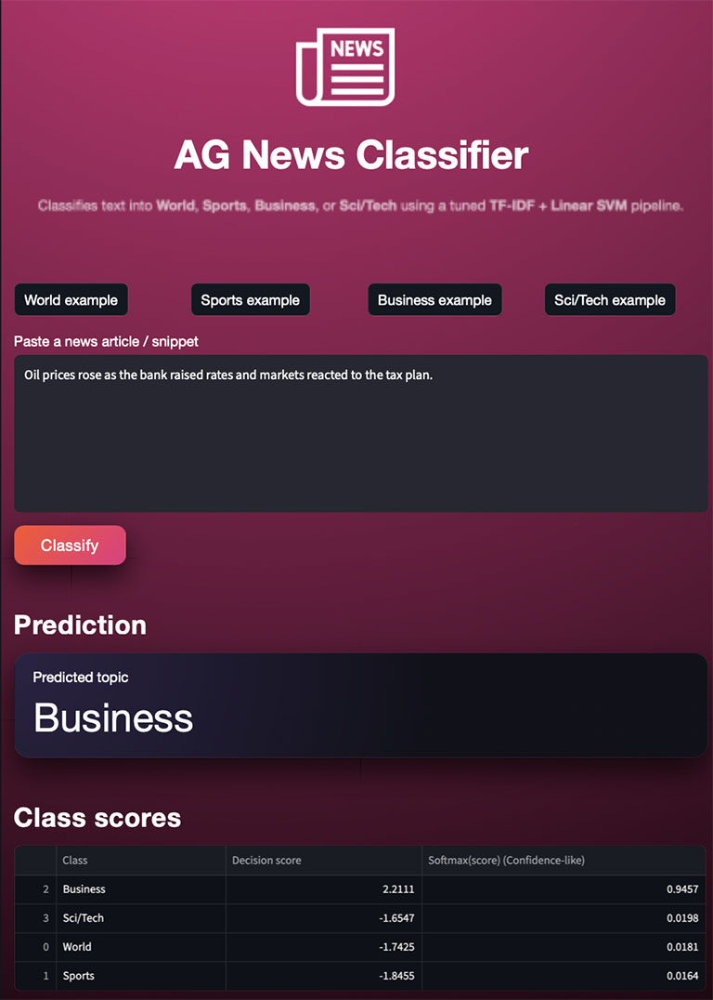

# NLP Text Classification (AG News)

## Overview
This project builds an end-to-end NLP text classification system that predicts the topic of a news article:
- World
- Sports
- Business
- Sci/Tech

The goal is to demonstrate a production-style NLP workflow: preprocessing, feature engineering (TF-IDF), model training/tuning, evaluation, error analysis, and deployment via a Streamlit app.

## Dataset
AG News (4-class topic classification). Loaded via the Hugging Face `datasets` library.

## Approach
- Baseline: TF-IDF + Logistic Regression
- Strong classical model: TF-IDF + Linear SVM (or Logistic Regression)
- Hyperparameter tuning with cross-validation
- Evaluation focused on macro-F1 + confusion matrix + per-class metrics

### Model
We use a classical NLP pipeline:
- TF-IDF vectorization (word n-grams)
- Linear SVM (LinearSVC)

This approach is fast, strong on sparse text features, and a common baseline in production NLP systems.


## Metrics
Primary:
- Macro F1 (multi-class)

Secondary:
- Accuracy
- Per-class precision/recall/F1
- Confusion matrix

## Results
Evaluation on the official AG News test split:

- Accuracy: **0.9230**
- Macro F1: **0.9228**

Key observations:
- Most confusion happens between **Business** and **Sci/Tech** (shared vocabulary).
- Short, ambiguous headlines reduce confidence and increase misclassification risk.

## Model Explainability

Because the classifier is linear, each token receives a weight per class.
Inspecting the highest-weighted tokens shows that the model learned meaningful,
topic-specific vocabulary rather than spurious correlations.

Examples of top tokens per class include:

- World: *iraq, afp, canadian press, iran*
- Sports: *coach, cup, team, season*
- Business: *economy, tax, oil, bank*
- Sci/Tech: *space, nasa, software, scientists*

This confirms that the model is capturing domain semantics in a transparent and interpretable way.

## Error Analysis

Most misclassifications occur between **Business** and **Sci/Tech** categories.
This is expected due to overlapping vocabulary (e.g., technology companies, innovation in markets).

Short headlines with limited context also increase ambiguity.
Potential improvements include:
- character n-grams for robustness
- transformer-based models to capture semantic context

## Demo Preview

The Streamlit app allows users to:
- paste or select example news text
- view the predicted topic
- inspect decision scores across all classes
- see which tokens most influenced the prediction

This improves transparency and trust, especially for non-technical users.

Run:
```bash
streamlit run app/app.py
```


