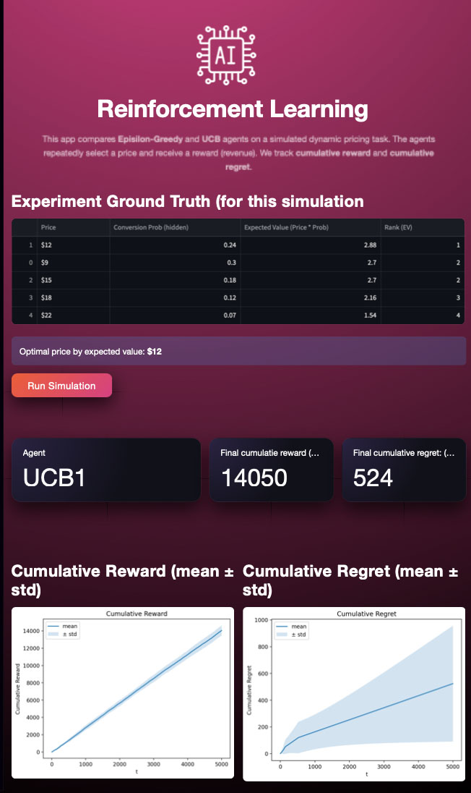

# Reinforcement Learning
### Dynamic Pricing with Multi-Armed Bandits

## Overview

This project demonstrates a Reinforcement Learning (RL) approach to dynamic pricing using a multi-armed bandit formulation.
An agent repeatedly selects a price, observes customer response, and learns to maximize long-term revenue through trial and error.

Two classical RL strategies are implemented and compared:
- Epsilon-Greedy
- Upper Confidence Bound (UCB1)

Performance is evaluated using cumulative reward and cumulative regret, and results are visualized through an interactive Streamlit dashboard.

## Problem Formulation
### Environment
- Each **action** corresponds to offering a specific price
- Each price has an **unknown conversion probability**
- Reward:
   - price if the customer purchases
   - 0 otherwise

The environment is **stationary** but **unknown** to the agent.

### Goal

Learn a pricing strategy that maximizes expected revenue over time, while minimizing regret from suboptimal decisions.


## Reinforcement Learning Setup
Component	Description
Agent	Pricing strategy
Action	Select a price
Reward	Revenue from purchase
State	None (bandit problem)
Feedback	Immediate
Objective	Maximize cumulative reward

| Component          | Description                |
|--------------------|----------------------------|
| Agent              | Pricing strategy           |
| Action             | Select a price             |
| Reward             | Revenue from purchase      |
| State              | None (bandit problem)      |
| Feedback           | Immediate                  |
| Objective          | Maximize cumulative reward |


This formulation reflects real-world use cases such as:
- pricing experiments
- ad selection
- recommendation ranking
- online A/B testing


## Algorithms Implemented
### 1. Epsilon-Greedy
- With probability ε, choose a random price (exploration)
- Otherwise, choose the best known price (exploitation)

#### Pros
- Simple
- Effective baseline

#### Cons
- Exploration is random
- Continues exploring indefinitely

### 2. Upper Confidence Bound (UCB1)
- Selects the action with the highest: **estimated_reward + uncertainty_bonus**
- Encourages exploration only when uncertainty is high

#### Pros
- Efficient exploration
- Lower long-term regret
- Strong theoretical guarantees

## Evaluation Metrics
### Cumulative Reward
Total revenue accumulated over time.

### Cumulative Regret
Difference between:
- reward obtained
- reward that would have been obtained by always choosing the optimal price

Lower regret indicates **faster and more efficient learning**.

## Results & Interpretation
- Both agents converge to similar **cumulative rewards**
- **UCB1 consistently achieves lower cumulative regret**
- Epsilon-Greedy continues to incur regret due to random exploration
- UCB1 explores early, then exploits decisively

These results align with theoretical expectations for bandit algorithms.

## Streamlit Demo

The interactive dashboard allows users to:
- Select the RL agent (Epsilon-Greedy or UCB1)
- Configure:
    - number of steps
    - number of runs
    - epsilon value
- View:
    - cumulative reward (mean ± std)
    - cumulative regret (mean ± std)
    - action selection distribution
- Inspect the ground-truth expected values for the simulation


## Run the app
```
streamlit run app/app.py
```




## Key Takeaways
- Reinforcement Learning is well-suited for sequential decision-making under uncertainty
- Regret is often a more informative metric than reward
- UCB-style exploration is more efficient than random exploration
- Bandit models are highly applicable to real business problems

##Possible Extensions
- Thompson Sampling
- Non-stationary environments
- Contextual bandits (features → pricing)
- Full MDP formulation with state

## Technologies Used
- Python
- NumPy
- Pandas
- Matplotlib
- Streamlit

## Final Note
This project emphasizes clarity, interpretability, and real-world relevance, demonstrating how classical reinforcement learning techniques can be applied to practical business problems.
