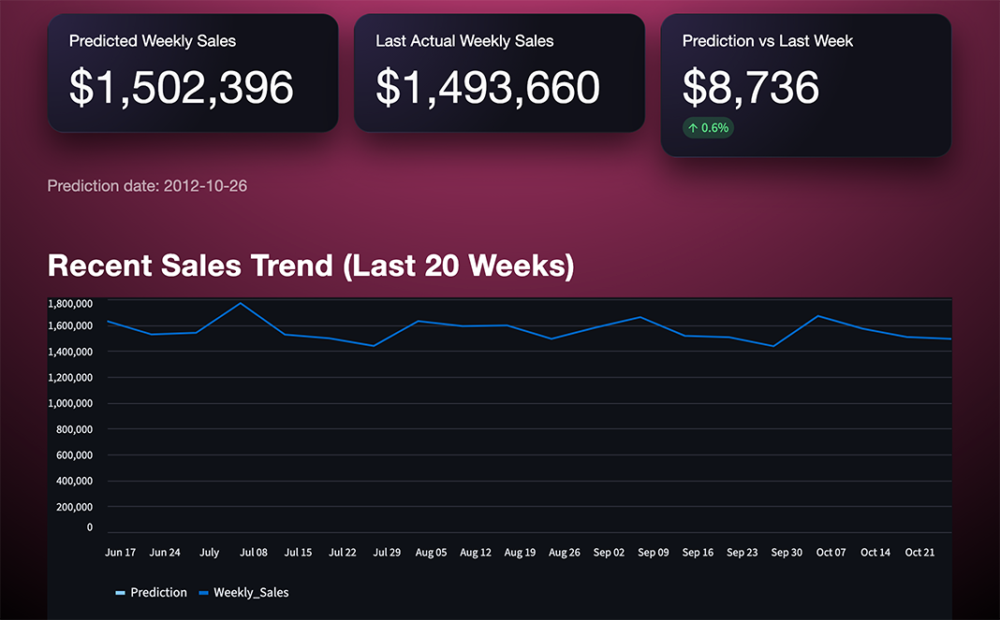

# Retail Demand Forecasting (Weekly Sales — Walmart)

## Overview

This project presents an end-to-end retail demand forecasting pipeline using weekly Walmart sales data. The objective is to predict future weekly sales while accounting for seasonality, holidays, store characteristics, and recent demand patterns. The project emphasizes time-series rigor, feature engineering, baseline comparisons, and model interpretability.

## Demo

## Problem Statement

Accurate demand forecasting is critical for inventory planning, supply chain optimization, and promotional strategy. Using historical weekly sales data, this project builds and evaluates forecasting models that predict future demand while avoiding common pitfalls such as data leakage and improper validation.

## Dataset

The project uses a reconstructed Walmart dataset composed of:
- Sales data: weekly sales by store and date
- Store metadata: store type and size
- External features: macroeconomic indicators and weather

The original dataset was denormalized; it was restructured into a production-style schema to reflect real-world data pipelines.

## Key Steps

1. **Data Preparation**
    - Schema normalization and type alignment
    - Time-aware merges with cardinality validation
    - Removal of sparse promotional features (markdowns)

2. **Exploratory Data Analysis (EDA)**
    - Demand distribution analysis (right-skewed sales)
    - Seasonality and holiday effects
    - Structural impact of store size and type
    - Correlation analysis

3. **Feature Engineering**
    - Lag features (e.g., last week’s sales)
    - Rolling statistics (4-week and 8-week averages)
    - Calendar features (week of year, year)
    - Leakage-safe transformations using `shift()`

4. **Modeling & Evaluation**
    - Naive Lag-1 baseline
    - Linear Regression
    - Random Forest
    - Gradient Boosting (best performer)

5. **Interpretability**
    - Feature importance analysis
    - SHAP global and local explanations

## Results

| Model              | Validation RMSE |
|--------------------|-----------------|
| Naive Lag-1        | ~75,313         |
| Linear Regression  | ~77,680         |
| Random Forest      | ~75,313         |
| **Gradient Boosting** | **~54,801** |

**Gradient Boosting significantly outperformed all baselines by capturing nonlinear relationships and interactions in demand dynamics.**

## Key Insights

- Recent demand history (lags and rolling averages) is the strongest predictor of weekly sales.
- Rolling averages outperform raw lags by reducing noise.
- Seasonality and holidays provide secondary but meaningful signal.
- Macroeconomic variables and store size stabilize predictions but do not dominate demand.

## Tech Stack

- Python, Pandas, NumPy
- Scikit-learn
- Matplotlib
- SHAP
- Streamlit (demo)

## Next Steps

- Extend forecasting to store–department level
- Compare MAE alongside RMSE
- Experiment with log-transformed targets
- Deploy the model in an interactive forecasting application